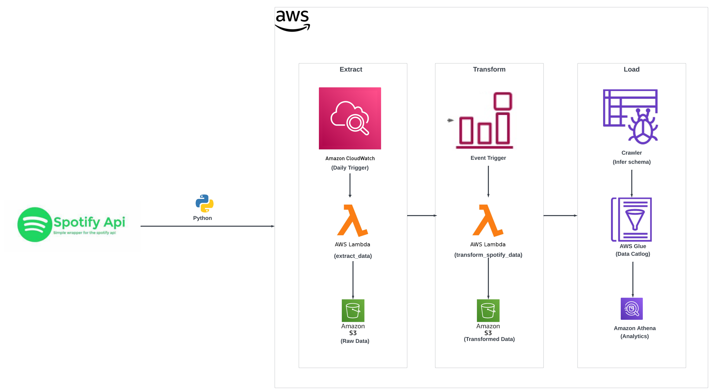

# Spotify Data Engineering Project with AWS

This project demonstrates the development of an ETL (Extract, Transform, Load) pipeline using Python and AWS services to process data from Spotify's "Discover Weekly" playlist. The pipeline extracts artist, album, and song information, transforms this data for analysis, and loads it into Amazon S3, with querying capabilities via Amazon Athena.

### Architecture Overview

### Tools and Services Used

- **Python**: For scripting the ETL process.
- **AWS S3**: To store raw and processed data.
- **AWS Lambda**: To run Python code for data extraction and transformation.
- **AWS CloudWatch**: For monitoring and logging.
- **AWS EventBridge**: To schedule data extraction.
- **AWS Glue**: For data cataloging and running crawlers to infer schema.
- **Amazon Athena**: To query transformed data.

  
### Pre-requisites

- Spotify API credentials (Client ID and Client Secret).
- AWS account setup with permissions for Lambda, S3, Glue, and Athena.
- Python environment for initial script development.
