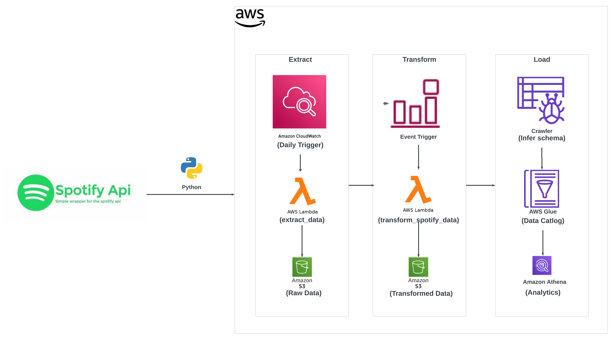

# Spotify Data Engineering Project with AWS

This project demonstrates the development of an ETL (Extract, Transform, Load) pipeline using Python and AWS services to process data from Spotify's "Discover Weekly" playlist. The pipeline extracts artist, album, and song information, transforms this data for analysis, and loads it into Amazon S3, with querying capabilities via Amazon Athena.

Tools and Services Used - Python,AWS S3,AWS Lambda,AWS CloudWatch,AWS EventBridge,AWS Glue,Amazon Athena

### Pre-requisites

- Spotify API credentials (Client ID and Client Secret).
- AWS account setup with permissions for Lambda, S3, Glue, and Athena.
- Python environment for initial script development.

### Architecture Overview

  
